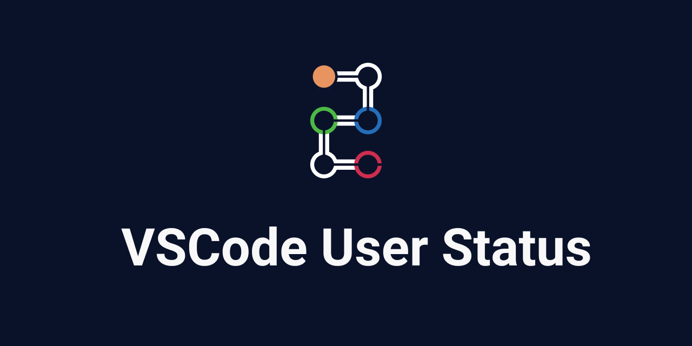

<h2 align="center">Supported</h2>
<p align="center">
  <em><a href="https://github.com/">GitHub</a> · <a href="https://slack.com/">Slack</a></em>
</p>

<!-- Should add align=center to the parent p tag -->
<p align="center"><a href="https://marketplace.visualstudio.com/items?itemName=nju33.vscode-user-status"></a>

<a href="https://codecov.io/gh/nju33/vscode-user-status"></a>
<a href="https://github.com/prettier/prettier"></a>
</p>


<!-- 
[](https://marketplace.visualstudio.com/items?itemName=nju33.vscode-user-status)

[](https://codecov.io/gh/nju33/vscode-user-status)
[](https://github.com/prettier/prettier)

 -->

### Intro

A VSCode extension to switch user status of multiple services from it.

### Extension Settings

- `userStatus.priority` Which one priority to get current user status: `github`(default), `slack`
- `userStatus.language` Status language: `en`(default), `ja`
- `userStatus.status` Additional status list
- `userStatus.github` Setting about GitHub
- `userStatus.slack` Setting about Slack

For instance, you do settings following like.

```json
{
  "userStatus.priority": "github",
  "userStatus.language": "en",
  "userStatus.status": {
    "📝": {
      "github": {
        "emojiName": "memo"
      },
      "slack": {
        "emojiName": "memo"
      },
      "text": "Writing",
      "priority": 150
    },
    "🍿": {
      "github": {
        "emojiName": "popcorn"
      },
      "slack": {
        "emojiName": "popcorn"
      },
      "text": "Watching a movie",
      "priority": 900
    }
  },
  "userStatus.github": {
    "enable": true,
    "username": "GITHUB_USER_NAME",
    "accessToken": "GITHUB_PERSONAL_ACCESS_TOKEN"
  },
  "userStatus.slack": {
    "enable": true,
    "workspaces": [
      {
        "user": "SLACK_MEMBER_ID",
        "accessToken": "SLACK_OAUTH_ACCESS_TOKEN"
      },
      {
        "user": "SLACK_MEMBER_ID(2)",
        "accessToken": "SLACK_OAUTH_ACCESS_TOKEN(2)"
      }
    ]
  }
}
```

### Preset

| emoji | priority | en                | ja               |
| :---: | :------: | :---------------- | :--------------- |
|  🎯   |   700    | Focusing          | 集中             |
|   ☕   |   600    | Taking a break    | 休憩中           |
|  🗓   |   500    | In a meeting      | 会議中           |
|  🚌   |   400    | On my way to work | 通勤途中         |
|  🌴   |   300    | On Vacation       | 休暇中           |
|  🏡   |   200    | Working from home | リモートで作業中 |
|  🤒   |   100    | Out sick          | 病欠             |

### Status

Each status item is sorted by `priority` of the setting property in descending numerical order.

### Contributors ✨

<!-- ALL-CONTRIBUTORS-BADGE:START - Do not remove or modify this section -->
[](#contributors-)
<!-- ALL-CONTRIBUTORS-BADGE:END -->

Thanks goes to these wonderful people ([emoji key](https://allcontributors.org/docs/en/emoji-key)):

<!-- ALL-CONTRIBUTORS-LIST:START - Do not remove or modify this section -->
<!-- prettier-ignore-start -->
<!-- markdownlint-disable -->
<table>
  <tr>
    <td align="center"><a href="https://nju33.com/"><br /><sub><b>純</b></sub></a><br /><a href="https://github.com/nju33/vscode-user-status/commits?author=nju33" title="Code">💻</a> <a href="#question-nju33" title="Answering Questions">💬</a> <a href="https://github.com/nju33/vscode-user-status/pulls?q=is%3Apr+reviewed-by%3Anju33" title="Reviewed Pull Requests">👀</a></td>
  </tr>
</table>

<!-- markdownlint-enable -->
<!-- prettier-ignore-end -->
<!-- ALL-CONTRIBUTORS-LIST:END -->

This project follows the [all-contributors](https://github.com/all-contributors/all-contributors) specification. Contributions of any kind welcome!
